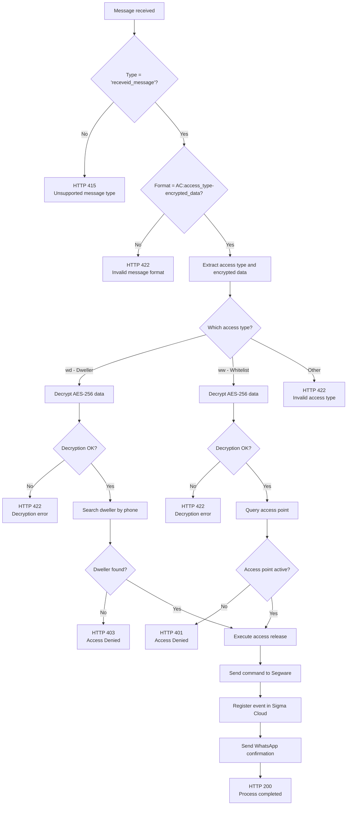

# 🔐 Access Control — WhatsApp

## 📋 Overview

Transforms access requests into a seamless, secure, and fully automated process. By scanning a QR Code, residents and visitors are redirected to WhatsApp with a pre-encrypted message ready to send. The system processes this message in real time, validates permissions, and if authorized grants physical access without any human intervention.

---

## 📱 Message Protocol

### 🔤 Required Format

```
AC:access_type-encrypted_data
```

### 🔑 Access Types

| Code | Type | Description | Validation Method |
|------|------|-------------|-------------------|
| `wd` | **Dweller** | _Registered dwellers_ | Search dweller by phone |
| `ww` | **Whitelist** | _Pre-authorized access points_ | Query access point |

### 💬 Valid Message Examples

```
AC:wd-af01c77b829768f236f4419f8c40117abc5a9c5bd9cc25be590cc0efab79eef2a
AC:ww-68a79c76d0f31ff6a9dd5d8fd06dafdbc218e8754697c26fba7a978abf6c6b2fe
```

---

## 📊 HTTP Response Codes

| Code | Scenario | WhatsApp Message | Technical Description |
|------|----------|------------------|----------------------|
| **200** | _Success_ | `✅ *Access Granted*` | _Physical access successfully released_ |
| **400** | _Missing required data_ | `⚠️ *Service Unavailable*` | _Mandatory parameters missing from request_ |
| **401** | _Unauthorized (whitelist)_ | `❎ *Access Denied*` | _Access point not found in authorized whitelist_ |
| **403** | _Dweller not found_ | `❎ *Access Denied*` | _Phone number not registered as dweller_ |
| **415** | _Unsupported type_ | _None_ | _Incorrect message type received_ |
| **422** | _Invalid format_ | `⚠️ *Service Unavailable*` | _Message format doesn't match required regex_ |
| **500** | _Internal error_ | `⚠️ *Service Unavailable*` | _Internal system processing failure_ |

---

## 📈 Detailed Flowchart


